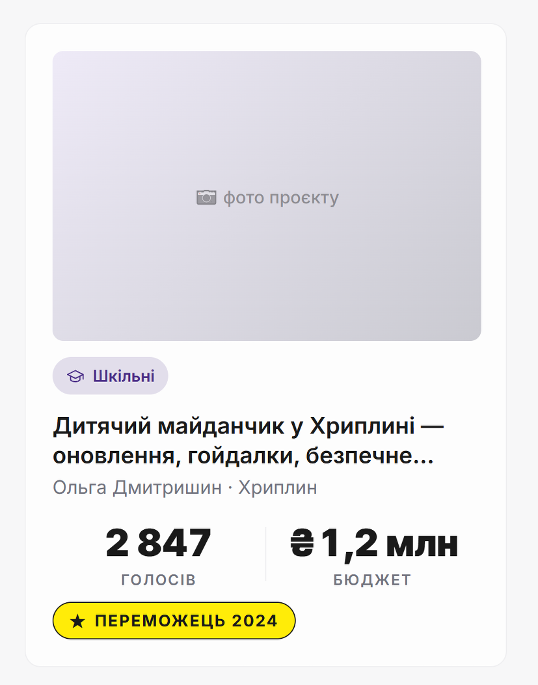
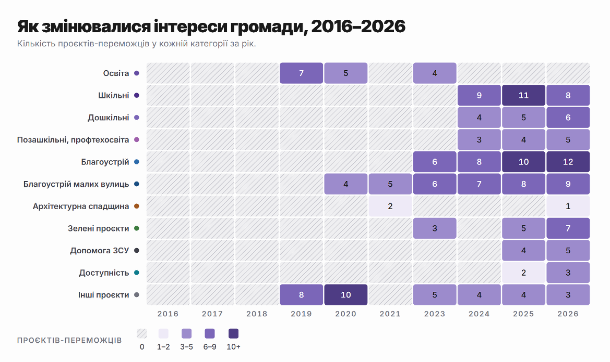
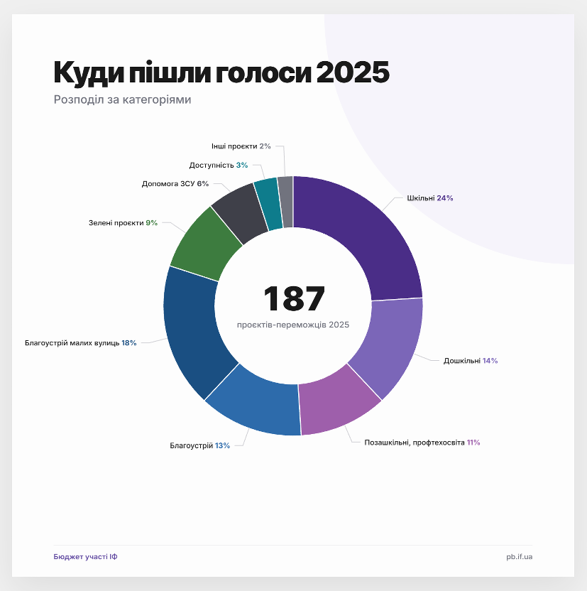

<p align="center">
  
</p>

<p align="center">
  <b>A universal standard for design solutions</b>
</p>

<p align="center">
  <a href="./prompts/"></a>
  <a href="./design.md"></a>
  <a href="./design.md"></a>
  <a href="https://opensource.org/licenses/MIT"></a>
</p>

<p align="center">
  <a href="README.ua.md">Читати українською (Read in Ukrainian)</a>
</p>

# Design System "Participatory Budget of Ivano-Frankivsk"

A design system for the Participatory Budget (PB) of the Ivano-Frankivsk municipality in [DESIGN.md](https://github.com/VoltAgent/awesome-design-md) format — a plain-markdown specification read by AI agents (Claude, Stitch, Cursor, Lovable, v0) to generate UI, infographics, and analytical visualizations adhering to the PB IF brand.

## What's inside

- **[design.md](./design.md)** — the design **system**: colors, typography, components, rules.
- **[design-data.md](./design-data.md)** *(beta)* — the **data layer**: real PB categories per year (2016–2026), canonical category palette, project statuses, map tokens. Subject to change pending municipal review.
- **Fonts:** [Phenomena](https://www.fontfabric.com/fonts/phenomena/) (headings, free for use but redistribution forbidden) and Proxima Nova (text/UI, commercial) — font files are not included in the repository and must not be committed.
- **[prompts/](./prompts/)** — ready-made prompts for typical tasks:
  - `infographics.md` — analytical infographics (heatmaps, voting charts, maps, rankings)
  - `social-media.md` — social media posts (1:1, 4:5, 9:16 stories)
  - `presentations.md` — slides for municipality/community presentations

## How to use this with AI

### Method 1 — provide a raw file link
Open a chat with Claude (claude.ai, Claude Code, Cursor) and write:

> Use the design system from this document: https://raw.githubusercontent.com/ifrc-ua/pb-design/main/design.md
>
> Create [what you need — infographic/card/slide].

The agent will download `design.md` and strictly follow all the rules — fonts, palette, geometry.

> **For production use, pin to a tagged version** instead of `main` — e.g. `https://raw.githubusercontent.com/ifrc-ua/pb-design/design-v1.2.0/design.md`. The `main` branch is a moving target; tagged versions are frozen and protect you from breaking changes. See [Releases](https://github.com/ifrc-ua/pb-design/releases) for available versions.

### Method 2 — copy to your project
Clone this repository (or copy `design.md` into the root of your project) and tell your AI tooling where to find it:

- **Claude Code**: create a `CLAUDE.md` next to `design.md` with one line — `Reference the design system in design.md for all UI work.` Claude Code reads `CLAUDE.md` automatically on every session.
- **Cursor**: create `.cursorrules` next to `design.md` with the same line. Cursor injects `.cursorrules` into every prompt.
- **Other agents**: most accept a system-prompt or "rules" file — point it at `design.md` once.

Just dropping `design.md` into the folder is **not enough** on its own — the agent has to be told to look at it.

### Method 3 — paste the content into the chat
Open `design.md`, copy its entire content, and paste it into the chat with the instruction:

> Here is the project design system. The task follows below.
>
> [paste design.md content]
>
> Task: [your task]

## Quick Prompt Example

> Use the design system from https://raw.githubusercontent.com/ifrc-ua/pb-design/main/design.md
>
> Create a 1080×1080 infographic for Instagram: top-5 PB Ivano-Frankivsk categories over 10 years (2016–2026, no PB in 2022), with the number of winning projects in each. Style: restrained, data in focus, purple accent background in the corner.

## Visual Examples (AI Renders)

This design system allows AI agents to generate complex interfaces and infographics that look cohesive. Here are a few examples of what can be created with a single prompt:

| Project Card (v0) | Analytical Heatmap (Claude) | Category Chart (Gemini) |
| :--- | :--- | :--- |
|  |  |  |

> Find more examples and detailed prompt descriptions in the **[assets/](./assets/)** folder.

## File Structure

```text
pb-design/
├── README.md           ← this file (English)
├── README.ua.md        ← human-facing intro (Ukrainian)
├── CLAUDE.md           ← guidance for AI agents working in this repo
├── LICENSE             ← MIT
├── design.md           ← main design system (English) — single source of truth
├── design.ua.md        ← design system (Ukrainian)
├── design-data.md      ← real PB categories/statuses/map tokens (English)
├── design-data.ua.md   ← real PB categories/statuses/map tokens (Ukrainian)
├── prompts/            ← ready-made prompts for typical tasks
│   ├── infographics.md       ← analytical infographics, charts, maps
│   ├── social-media.md       ← Instagram/Facebook posts, stories, carousels
│   ├── presentations.md      ← 16:9 deck slides for municipality talks
│   └── render-examples.md    ← self-contained prompts for AI tool comparison
├── assets/             ← cover images + AI-generated reference renders
│   ├── pb_photo.png / pb_photo_ua.png   ← README covers
│   ├── Claude-opus-4.7/      ← reference renders (each folder has its own README)
│   ├── Gemini-3.1-pro/
│   └── v0-max/
└── .gitignore          ← excludes licensed font files (.otf/.ttf) from commits
```

## The Brand in a Nutshell

- **Colors:** purple  + yellow  on near-white , text .
- **Fonts:** Phenomena — headings and large numbers; Proxima Nova — everything else.
- **Vibe:** municipal trust + community energy. Restraint, clarity, large numbers, plenty of whitespace.
- **Context:** analytics for **10 years of PB** Ivano-Frankivsk across the 2016–2026 timeframe (no PB held in 2022). Not the active voting cycle.

## Design Principles in a Nutshell

- **Accessibility-first** — every color pair in `design.md` is verified against WCAG AA (≥4.5:1 for body text). No exceptions.
- **Restraint over decoration** — no gradients, no neon, no parallax. The data is the hero; the interface gets out of the way.
- **AI-parseable + human-readable** — YAML frontmatter for machines, prose for the *why* behind each rule. Both stay in sync; YAML wins on conflicts.
- **Mobile-first** — designed at 375px width first; 44×44px touch targets; bottom-sheets over hover-only interactions.
- **Static stillness with one signature flourish** — no animation by default; the only choreographed moment is the count-up of hero numbers when they enter the viewport. Always honors `prefers-reduced-motion`.
- **Numbers obey UA locale** — non-breaking space for thousands (`14 832`), comma for decimals (`3,7%`), `tabular-nums` everywhere. AI agents that default to `14,832` are corrected by the spec.
- **Explicit "out of scope"** — dark mode, live voting, admin UI, and submission forms are deliberately not designed. Real PB data (categories, statuses, map tokens) is split into `design-data.md`; agents leave `<!-- TODO: design-data.md needs X -->` markers rather than fabricate.

## License and Fonts

This design system is distributed under the [MIT](https://opensource.org/licenses/MIT) license.

Fonts are **not included in this repository** — and must not be committed to it. Download them separately for local use:

- **Phenomena** — free for personal and commercial use at [fontfabric.com](https://www.fontfabric.com/fonts/phenomena/) (email-gated download, 7 weights, Thin → Black). The Fontfabric Free Fonts EULA **forbids redistribution** of the font files — do not upload `.otf` / `.ttf` to public repositories. `@font-face` embedding on your own website is allowed.
- **Proxima Nova** — commercial license at [Mark Simonson Studio](https://www.marksimonson.com/fonts/view/proxima-nova). No free tier; redistribution forbidden.

If the original fonts are unavailable, use the following free alternatives from Google Fonts (OFL license):
- For **Phenomena** (headings): [Inter Tight](https://fonts.google.com/specimen/Inter+Tight) (900 Black weight).
- For **Proxima Nova** (UI and text): [Inter](https://fonts.google.com/specimen/Inter) (with mandatory `tabular-nums` for digits).
- *Secondary fallback:* Geist Sans / Geist Mono.

See `design.md` for detailed instructions on correcting letter spacing and line height when using fallback fonts.


## Contributing

1. Make edits to the relevant file.
2. `git add . && git commit -m "brief description of change"`
3. `git push`

Changes will immediately be picked up by agents referencing the raw URL.

---

*Created based on the [awesome-design-md](https://github.com/VoltAgent/awesome-design-md) template by VoltAgent.*
