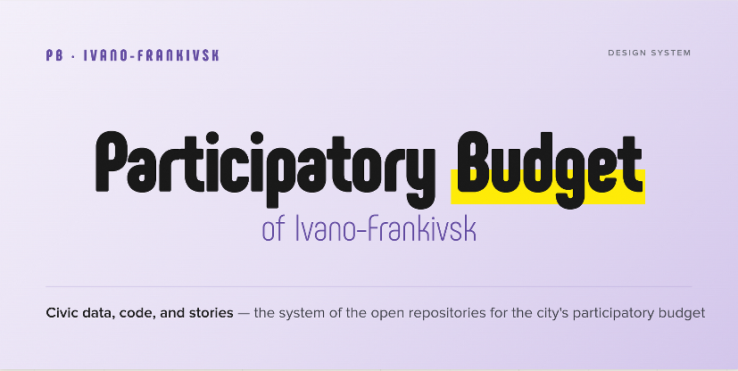

<p align="center">
  
</p>

<h1 align="center">Design System "Participatory Budget of Ivano-Frankivsk"</h1>
<p align="center">
  A universal standard for design solutions
</p>

<p align="center">
  <a href="./prompts/"></a>
  <a href="./design.md"></a>
  <a href="./design.md"></a>
  <a href="https://opensource.org/licenses/MIT"></a>
</p>

<p align="center">
  <a href="README.ua.md">Читати українською (Read in Ukrainian)</a>
</p>

A design system for the Participatory Budget (PB) of the Ivano-Frankivsk municipality in [DESIGN.md](https://github.com/VoltAgent/awesome-design-md) format — a plain-markdown specification read by AI agents (Claude, Stitch, Cursor, Lovable, v0) to generate UI, infographics, and analytical visualizations adhering to the PB IF brand.

## What's inside

- **[design.md](./design.md)** — the main design system document: colors, fonts, components, rules.
- **Fonts:** [Phenomena](https://www.fontfabric.com/fonts/phenomena/) (headings, free) and Proxima Nova (text/UI, commercial) — font files are not included in the repository.
- **[prompts/](./prompts/)** — ready-made prompts for typical tasks:
  - `infographics.md` — analytical infographics (heatmaps, voting charts, maps, rankings)
  - `social-media.md` — social media posts (1:1, 4:5, 9:16 stories)
  - `presentations.md` — slides for municipality/community presentations

## How to use this with AI

### Method 1 — provide a raw file link
Open a chat with Claude (claude.ai, Claude Code, Cursor) and write:

> Use the design system from this document: https://raw.githubusercontent.com/ifrc-ua/pb-design/main/design.md
>
> Create [what you need — infographic/card/slide].

The agent will download `design.md` and strictly follow all the rules — fonts, palette, geometry.

### Method 2 — copy to your project
Clone this repository or copy `design.md` into the root of your project. Agents (Cursor, Claude Code) working within your folder will automatically detect this file.

### Method 3 — paste the content into the chat
Open `design.md`, copy its entire content, and paste it into the chat with the instruction:

> Here is the project design system. The task follows below.
>
> [paste design.md content]
>
> Task: [your task]

## Quick Prompt Example

> Use the design system from https://raw.githubusercontent.com/ifrc-ua/pb-design/main/design.md
>
> Create a 1080×1080 infographic for Instagram: top-5 PB Ivano-Frankivsk categories over 10 years, with the number of winning projects in each. Style: restrained, data in focus, purple accent background in the corner.

## File Structure

```text
pb-design/
├── README.md           ← this file (English)
├── README.ua.md        ← human-facing intro (Ukrainian)
├── design.md           ← main design system (English)
├── design.ua.md        ← design system (Ukrainian)
└── prompts/
    ├── infographics.md
    ├── social-media.md
    └── presentations.md
```

## The Brand in a Nutshell

- **Colors:** purple  + yellow  on near-white , text .
- **Fonts:** Phenomena — headings and large numbers; Proxima Nova — everything else.
- **Vibe:** municipal trust + community energy. Restraint, clarity, large numbers, plenty of whitespace.
- **Context:** analytics for **10 years of PB** Ivano-Frankivsk (2016–2025). Not the active voting cycle.

## License and Fonts

This design system is distributed under the [MIT](https://opensource.org/licenses/MIT) license.

Fonts are **not included in this repository** — download them separately:

- **Phenomena** — free at [fontfabric.com](https://www.fontfabric.com/fonts/phenomena/) (7 weights, Thin → Black)
- **Proxima Nova** — commercial license at [Mark Simonson Studio](https://www.marksimonson.com/fonts/view/proxima-nova)

If the original fonts are unavailable, use the following free alternatives from Google Fonts (OFL license):
- For **Phenomena** (headings): [Inter Tight](https://fonts.google.com/specimen/Inter+Tight) (900 Black weight).
- For **Proxima Nova** (UI and text): [Inter](https://fonts.google.com/specimen/Inter) (with mandatory `tabular-nums` for digits).
- *Secondary fallback:* Geist Sans / Geist Mono.

See `design.md` for detailed instructions on correcting letter spacing and line height when using fallback fonts.


## Contributing

1. Make edits to the relevant file.
2. `git add . && git commit -m "brief description of change"`
3. `git push`

Changes will immediately be picked up by agents referencing the raw URL.

---

*Created based on the [awesome-design-md](https://github.com/VoltAgent/awesome-design-md) template by VoltAgent.*
