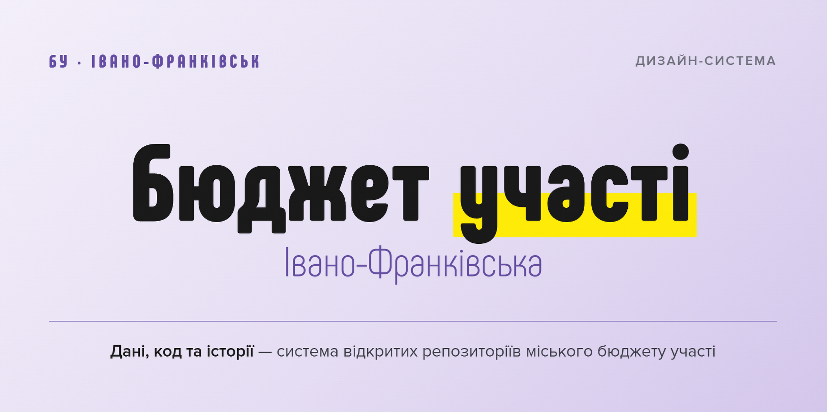

<p align="center">
  
</p>

<p align="center">
  <b>Універсальний стандарт для дизайн-рішень</b>
</p>

<p align="center">
  <a href="./prompts/"></a>
  <a href="./design.ua.md"></a>
  <a href="./design.ua.md"></a>
  <a href="https://opensource.org/licenses/MIT"></a>
</p>

<p align="center">
  <a href="README.md">🇬🇧 Read in English</a>
</p>

# Дизайн-система «Бюджет участі Івано-Франківської громади»

---

Дизайн-система для бюджету участі (громадського бюджету) Івано-Франківської громади у форматі [DESIGN.md](https://github.com/VoltAgent/awesome-design-md) — плейн-маркдаун, який читають AI-агенти (Claude, Stitch, Cursor, Lovable, v0) і генерують UI, інфографіку та аналітичні візуалізації в бренді бюджету участі Івано-Франківська.

## Що тут є

- **[design.md](./design.md)** — головний документ дизайн-системи: кольори, шрифти, компоненти, правила.
- **Шрифти:** [Phenomena](https://www.fontfabric.com/fonts/phenomena/) (заголовки, безкоштовний для використання, але redistribution заборонено) і Proxima Nova (текст/UI, комерційний) — файли не включені до репозиторію і не повинні комітитися.
- **[prompts/](./prompts/)** — готові промпти для типових задач:
  - `infographics.md` — аналітична інфографіка (heatmaps, діаграми голосів, мапи, рейтинги)
  - `social-media.md` — пости для соцмереж (1:1, 4:5, stories 9:16)
  - `presentations.md` — слайди для презентацій мерії/громади

## Як цим користуватися з AI

### Спосіб 1 — дати посилання на raw-файл
Відкрийте чат з Claude (claude.ai, Claude Code, Cursor) і напишіть:

> Використай дизайн-систему з цього документа: https://raw.githubusercontent.com/ifrc-ua/pb-design/main/design.md
>
> Створи [що саме — інфографіку/картку/слайд].

Агент завантажить `design.md` і буде дотримуватися усіх правил — шрифтів, палітри, геометрії.

### Спосіб 2 — скопіювати у свій проєкт
Склонуйте цей репозиторій або скопіюйте `design.md` у корінь вашого проєкту. Агенти (Cursor, Claude Code), які працюють із вашою папкою, автоматично побачать цей файл.

### Спосіб 3 — вставити вміст у чат
Відкрийте `design.md`, скопіюйте весь вміст, вставте в чат з інструкцією:

> Ось дизайн-система проєкту. Нижче йде завдання.
>
> [вставити вміст design.md]
>
> Завдання: [ваше завдання]

## Швидкий приклад промпту

> Використай дизайн-систему з https://raw.githubusercontent.com/ifrc-ua/pb-design/main/design.md
>
> Створи інфографіку 1080×1080 для Instagram: топ-5 категорій БУ Івано-Франківська за 10 років (2016–2026, у 2022 БУ не проводився), з кількістю проєктів-переможців у кожній. Стиль: стриманий, дані у центрі уваги, фіолетовий фон-акцент у куті.

## Структура файлів

```text
pb-design/
├── README.md           ← human-facing intro (English)
├── README.ua.md        ← цей файл (українською)
├── design.md           ← головна дизайн-система (English)
├── design.ua.md        ← дизайн-система (українською)
└── prompts/
    ├── infographics.md
    ├── social-media.md
    └── presentations.md
```

## Бренд у двох словах

- **Кольори:** фіолетовий  + жовтий  на майже-білому , текст .
- **Шрифти:** Phenomena — заголовки й великі числа; Proxima Nova — усе інше.
- **Характер:** муніципальна довіра + енергія громади. Стриманість, ясність, великі числа, багато повітря.
- **Контекст:** аналітика **10 років БУ** Івано-Франківська за період 2016–2026 (у 2022 БУ не проводився). Не поточний цикл.

## Ліцензія та шрифти

Дизайн-система поширюється за ліцензією [MIT](https://opensource.org/licenses/MIT).

Шрифти **не включені до цього репозиторію** — і не повинні бути додані до нього. Завантажуйте локально для роботи:

- **Phenomena** — безкоштовно для особистого та комерційного використання на [fontfabric.com](https://www.fontfabric.com/fonts/phenomena/) (завантаження через email-форму, 7 накреслень, Thin → Black). Fontfabric Free Fonts EULA **забороняє redistribution** файлів шрифту — не завантажуйте `.otf` / `.ttf` у публічні репозиторії. `@font-face`-вбудовування на власному сайті дозволено.
- **Proxima Nova** — комерційна ліцензія на [Mark Simonson Studio](https://www.marksimonson.com/fonts/view/proxima-nova). Безкоштовної версії немає; redistribution заборонено.

Якщо оригінальні шрифти недоступні, використовуйте такі безкоштовні замінники з Google Fonts (ліцензія OFL):
- Для **Phenomena** (заголовки): [Inter Tight](https://fonts.google.com/specimen/Inter+Tight) (накреслення 900 Black).
- Для **Proxima Nova** (UI і текст): [Inter](https://fonts.google.com/specimen/Inter) (з обов'язковим `tabular-nums` для цифр).
- *Другий резерв:* Geist Sans / Geist Mono.

Детальні інструкції щодо корекції міжлітерного інтервалу та висоти рядка для замінників дивіться у файлі `design.md`.


## Внесення змін

1. Внесіть правки у відповідний файл.
2. `git add . && git commit -m "коротко що змінили"`
3. `git push`

Зміни одразу підхопляться агентами, що посилаються на raw-URL.

---

*Створено на базі шаблону [awesome-design-md](https://github.com/VoltAgent/awesome-design-md) від VoltAgent.*
